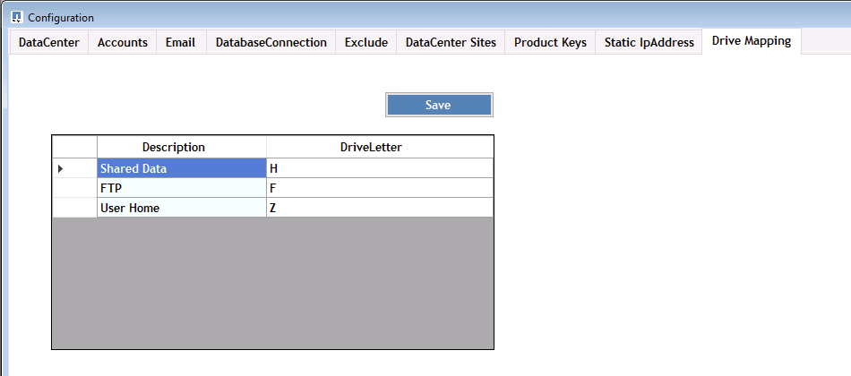

= Überblick
:allow-uri-read: 

== Überblick

DCConfig ist ein Konfigurationsdienstprogramm auf der CWMGER1-VM, mit dem viele Bereitstellungseinstellungen festgelegt und geändert werden.

. Stellen Sie eine Verbindung zur CWMGER1-VM als Administrator her
. Führen Sie die Anwendung über die Desktop-Verknüpfung aus

In der Anwendung gibt es drei Hauptabschnitte: Konfiguration, Erweitert und Hilfe.

=== Konfigurationen

Das Konfigurationsfenster wird beim Start geöffnet und hat mehrere Unterabschnitte

==== Rechenzentrum

image::images/Management.dcconfig.dcconfig.overview-61c8f.png[Management.dcconfig.dcconfig.overview 61c8f]

==== Konten

image::images/Management.dcconfig.dcconfig.overview-f34a2.png[Management.dcconfig.dcconfig.overview f34a2]

==== E-Mail

image::images/Management.dcconfig.dcconfig.overview-4b3be.png[Management.dcconfig.dcconfig.overview 4b3be]

==== DatabaseVerbindung

image::images/Management.dcconfig.dcconfig.overview-80da7.png[Management.dcconfig.dcconfig.overview 80da7]

==== Ausschließen

==== An Datacenter-Standorten aus

image::images/Management.dcconfig.dcconfig.overview-95b21.png[Management.dcconfig.dcconfig.overview 95b21]

==== Produktschlüssel

image::images/Management.dcconfig.dcconfig.overview-298a0.png[Management.dcconfig.dcconfig.overview 298a0]

==== Statische IP-Adresse

image::images/Management.dcconfig.dcconfig.overview-7e4a4.png[Management.dcconfig.dcconfig.overview 7e4a4]

==== Laufwerkzuordnung

=== Erweitert

Das Fenster Erweitert zeigt eine Liste von Werten an, die über diese Schnittstelle bearbeitet werden können.

[cols="33,33,33"]
|===
| Gruppenname | FreundesName | Wert 

| Gruppenname | FreundesName | Wert 

| Server-Erstellung | UpdateVMNameWhenRemovedFromCache | Richtig/Falsch 

| Server-Erstellung | UpdateFirewallregeln | Richtig/Falsch 

| Server-Erstellung | WaitAfterReboBootMin | <# Minuten> 

| Server-Erstellung | WaitAfterHypervisorCreateMin | <# Minuten> 

| Server-Erstellung | WaitAfterSysPrepMin | <# Minuten> 

| Server-Erstellung | WaitAfterSysPrepFor2008ServerMin | <# Minuten> 

| Server-Erstellung | GFI Agentenpfad |  

| Server-Erstellung | Automatisiertes Klonen Ist Aktiviert | Richtig/Falsch 

| Server-Erstellung | FirmenOU | <String - Unternehmen OU Name> 

| Server-Erstellung | Installation von ThinPrint v11 | Richtig/Falsch 

| Server-Erstellung | ServersOU | <String - Server OU Name> 

| Server-Erstellung | Installieren Sie FsLogix | Richtig/Falsch 

| Server-Erstellung | Standard-OUs verwenden | Richtig/Falsch 

| Server-Erstellung | Max. Threads | <#> 

| Server-Erstellung | Warten Sie, bis DNS die Minuten aktualisiert | <# Minuten> 

| Überprüfen Sie Die Version Der Vdc-Werkzeuge | Lauf alle X Minuten | <# Minuten> 

| Tägliche Aktionen | Aktiviert | Richtig/Falsch 

| Tägliche Aktionen | Beim Start ausführen | Richtig/Falsch 

| Berichte Erstellen | Tageszeit | <ZEIT 00:00> 

| Tägliche Wartung | Aktiviert | Richtig/Falsch 

| Tägliche Wartung | Tageszeit | <ZEIT 00:00> 

| Wöchentliche Wartung | Aktiviert | Richtig/Falsch 

| Wöchentliche Wartung | Tageszeit | <ZEIT 00:00> 

| Wöchentliche Wartung | Tag | <Tag der Woche> 

| Automatische Ressourcenzuteilung | Aktiviert | Richtig/Falsch 

| Ressourcenzuweisung | Verwenden Sie Die Standards Für Das Datacenter | Richtig/Falsch 

| EmailReports | IncludeEmailAnhang | Richtig/Falsch 

| Heartbeat Für Server | Intervallminuten | <# Minuten> 

| Laden Sie AutoPro-Daten herunter | Intervallminuten | <# Minuten> 

| Heartbeat im Datacenter | Intervallminuten | <# Minuten> 

| Server Wird Neu Gestartet | Aktiviert | Richtig/Falsch 

| Server Wird Neu Gestartet | Verzögerung Zwischen Neustarts Von Minuten | <# Minuten> 

| FreeSpaceReport | MinFreeSpaceGB | <# GB Mindestschwellenwert> 

| MaxRebootTimeSpanHours | Clientserver | <# Stunden vor dem erforderlichen Neustart> 

| MaxRebootTimeSpanHours | Server für Infrastrukturserver | <# Stunden vor dem erforderlichen Neustart> 

| VDC-Tools automatisch aktualisieren | Aktiviert | Richtig/Falsch 

| ActivateOffice | Aktiviert | Richtig/Falsch 

| ActivateWindows | Aktiviert | Richtig/Falsch 

| Monitoring | Max. Aufbewahrungstage | <# Tage> 

| Protokolle | Max. Aufbewahrungstage | <# Tage> 

| Berichtsdaten | Max. Aufbewahrungstage | <# Tage> 

| Dateiprüfung | Max. Aufbewahrungstage | <# Tage> 

| Dateiprüfung | Detaillierte Protokollierung | Richtig/Falsch 

| FileAuditFolder | NumFolder | 2 

| FileAuditFolder1 | Pfad | [DataDrive]:\Data 

| FileAuditFolder1 | Ausschließen | *Thumbs.db 

| FileAuditFolder1 | Ausschließen | *.tmp 

| FileAuditFolder1 | Ausschließen | *~ €*.doc 

| FileAuditFolder1 | Ausschließen | *~ €*.docx 

| FileAuditFolder2 | Pfad | [DataDrive]:\Home 

| FileAuditFolder2 | Ausschließen | Daumen.db 

| CwVmAutomationService | Dienstbefehlen Argumente |  

| FtpReleaeAddress | URL | <ftp-URL> 

| Workload-Zeitplan | Lauf alle X Minuten | <# Minuten> 

| Workload-Zeitplan | Schalten Sie Cache-Unternehmen Aus | Richtig/Falsch 

| Backups Erstellen | Aktiviert | Richtig/Falsch 

| Backups Erstellen | Lauf alle X Minuten | <# Minuten> 

| Monitoring Von Anwendungen | Aktiviert | Richtig/Falsch 

| STIFT | InitialSleepSeconds | <# Sekunden> 

| STIFT | MusteChangePasswordDay | <# Tage vor Ablauf des erzwungenen PW-Rücksetzens> 

|  |  | <Text-Zeichenfolge zum Zurücksetzen des Passworts> 

| STIFT | Logo | <lokale .png Logo-Pfad> 

| STIFT | NumNotifyDays | <# Tage> 

| STIFT | Notifikation1. Tag | <# Tage vor Ablauf der Benachrichtigung> 

| STIFT | NotifikationTag 2 | <# Tage vor Ablauf der Benachrichtigung> 

| STIFT | NotifikationTag 3 | <# Tage vor Ablauf der Benachrichtigung> 

| STIFT | NotificationDay4 | <# Tage vor Ablauf der Benachrichtigung> 

| STIFT | NotificationDay5 | <# Tage vor Ablauf der Benachrichtigung> 

| STIFT | NotificationDay6 | <# Tage vor Ablauf der Benachrichtigung> 

| Monitoring | Aktiviert | Richtig/Falsch 

| Monitoring | E-Mail-Benachrichtigungen Senden | Richtig/Falsch 

| Monitoring | Alarmserver für Minuten ausgefallen | <# Minuten> 

| Monitoring | Benachrichtigen Sie RAM High für Minuten | <# Minuten> 

| Monitoring | Ram Hoch % | <RAM %-Schwellenwert> 

| Monitoring | Warnung CPU-hoch über Minuten | <# Minuten> 

| Monitoring | CPU hoch % | <CPU %-Schwellenwert> 

| Monitoring | Festplattenplatz Niedrig Prozent | <Schwellenwert Für Freien Speicherplatz %> 

| Client-Verzögerung Löschen | Minuten | <# Minuten> 

| Laufwerk Automatisch Erweitern | Aktiviert | Richtig/Falsch 

| Verstärkte Sicherheit | Aktiviert | Richtig/Falsch 

| Führen Sie CwAgent als Domänenadministrator aus | Aktiviert | Richtig/Falsch 

| Server Überwachen | Verwenden von SolarWinds | Richtig/Falsch 

| H5 Portal automatisch aktualisieren | Aktiviert | Richtig/Falsch 

| Installieren Sie das Platzhalter-Zertifikat | Auf Infrastruktur-Servern | Richtig/Falsch 

| Gründung Des Unternehmens | In Unique Site | Richtig/Falsch 

| Live-Skalierung | Zeitverzögerung Ausschaltung Min | <# Minuten> 

| Server-Ressourcenbericht | Überprüfen Sie DNS | Richtig/Falsch 

| Hypervisor | Cache-Vorlagen | Richtig/Falsch 

| Detaillierte Protokollierung | Live-Skalierung | Richtig/Falsch 

| Detaillierte Protokollierung | Live Scaling-Show Server Status | Richtig/Falsch 

| Detaillierte Protokollierung | Workload-Planung | Richtig/Falsch 

| Detaillierte Protokollierung | Server Aus Vorlage Erstellen | Richtig/Falsch 

| Detaillierte Protokollierung | Server Aus Vorlagenzeiteinstellung Erstellen | Richtig/Falsch 

| Detaillierte Protokollierung | Server Aus Backup Erstellen | Richtig/Falsch 

| Detaillierte Protokollierung | Erstellen Sie Server Aus Clone | Richtig/Falsch 

| Detaillierte Protokollierung | Vorlage Erstellen | Richtig/Falsch 

| Detaillierte Protokollierung | Mit Anderen Services Kommunizieren | Richtig/Falsch 

| Vorlage Erstellen | Manuell RunSysPrep | Richtig/Falsch 

| Domain Controller | Name | Cwmgr1.<domain.com> 
|===
image::images/Management.dcconfig.dcconfig.overview-9c7ac.png[Management.dcconfig.dcconfig.overview 9c7ac]

=== Hilfe

Öffnet die lokale Hilfedatei.
